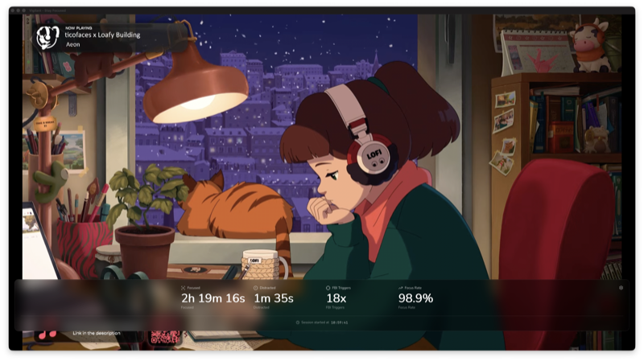
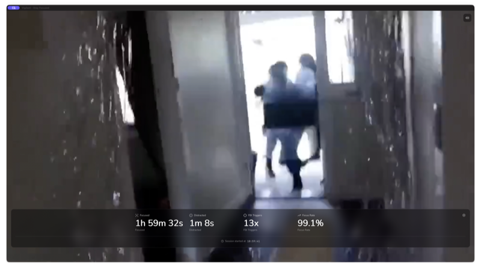

# Vigilant 🚨

**The FBI is watching your screen.**

Try to open Discord? Reddit? Twitter? *FBI OPEN UP* blasts at full volume until you get back to work.

Stay focused = lofi beats. Get distracted = FBI raid.

<p align="center">
  
  
</p>

## Features

- 🎵 **Lofi Mode** - Chill YouTube stream while you work
- 🚨 **FBI Mode** - Classic meme video when you slack off (full volume, of course)
- 📊 **Stats** - Track focus time, distractions, and FBI trigger count
- ⚙️ **Custom Blocklist** - Block whatever distracts you (regex support)
- 💻 **Cross-Platform** - Windows 11 and macOS (Intel + Apple Silicon)
- 🔒 **Privacy** - No telemetry, no data collection, just judgement

## Installation

### Quick Start

1. **Download** the latest release from [Releases Page](https://github.com/mgiovani/vigilant/releases)
2. **macOS**:
   - Download `vigilant-darwin-universal-vX.X.X.zip`
   - Extract and move `vigilant.app` to Applications
   - On first run, grant Accessibility permissions when prompted
   - System Preferences → Security & Privacy → Accessibility → Add Vigilant
3. **Windows 11**:
   - Download `vigilant-windows-amd64-vX.X.X.zip`
   - Extract and run `vigilant.exe`
   - Click "More info" → "Run anyway" if SmartScreen blocks it

### Building from Source

**Requirements**:
- Go 1.23+
- Node.js 18+ (for frontend)
- Make

**Steps**:
```bash
# Clone repository
git clone https://github.com/mgiovani/vigilant.git
cd vigilant

# Build and install (one command)
make install

# Or step by step:
make setup    # Install dependencies
make build    # Build for your OS
make dev      # Development mode with hot reload
```

## Configuration

### Default Blocklist

Out of the box, the FBI will raid you for:
- **Apps**: Discord, Steam, Battle.net
- **Social**: YouTube, Twitter/X, Reddit, Instagram, TikTok, Facebook, Twitch
- **Streaming**: Netflix, Prime Video, Disney+, Hulu, HBO Max, Paramount+

### Customizing Your Blocklist

1. **Locate config file**:
   - First launch creates: `~/.vigilant/config.yaml`
   - Or use bundled default: `config/default.yaml`

2. **Edit config.yaml**:
   ```yaml
   # All patterns are regex-based and case-insensitive
   # Patterns match both window titles AND process names
   blocklist:
     patterns:
       - "discord"          # Matches Discord app or browser tabs
       - "reddit"           # Matches reddit.com in browser
       - "youtube"          # Matches YouTube (except exceptions below)
       - "my-game\\.exe"    # Custom regex pattern

   # Exceptions bypass the blocklist when matched
   exceptions:
     - "youtube music"      # YouTube Music won't trigger FBI
     - "youtube studio"     # Allow content creation

   player:
     lofi_playlist: "https://www.youtube.com/watch?v=jfKfPfyJRdk"
     default_volume: 0.5    # 0.0-1.0

   monitor:
     poll_interval: 100ms   # Check window every 100ms
     grace_period: 500ms    # 500ms delay before FBI meme
   ```

3. **Restart** Vigilant to apply changes

### Configuration Format

| Setting | Type | Default | Description |
|---------|------|---------|-------------|
| `blocklist.patterns` | List | See above | Regex patterns (case-insensitive, match title & process) |
| `exceptions` | List | [] | Regex patterns that bypass blocklist |
| `player.lofi_playlist` | URL | Lofi Girl stream | YouTube video/playlist URL |
| `player.default_volume` | Float | 0.5 | Volume level (0.0-1.0) |
| `monitor.poll_interval` | Duration | 100ms | How often to check active window |
| `monitor.grace_period` | Duration | 500ms | Delay before triggering FBI meme |

## How It Works

1. **Start Vigilant** - App opens with lofi beats playing
2. **Work** - Focus time goes up, you're being productive
3. **Get tempted** - Switch to Discord, Reddit, YouTube...
4. **Grace period** - You have 500ms to reconsider your life choices
5. **FBI OPEN UP** - Meme plays at full volume until you alt-tab away
6. **Back to work** - Lofi resumes, FBI counter increases, shame ensues

## Troubleshooting

### FAQ

**Q: YouTube says "error 153" or video won't load**
A: This is a common Wails issue with YouTube embedding. Try:
   1. Check internet connection
   2. Restart Vigilant
   3. Update to latest version
   4. If persists, YouTube may have changed policies (check releases)

**Q: App says "Accessibility Permission Denied" (macOS)**
A: Grant permission:
   1. System Preferences → Security & Privacy → Accessibility
   2. Click the lock to unlock
   3. Click "+" button and select Vigilant application
   4. Restart Vigilant

**Q: Windows app doesn't open / shows nothing**
A: The app requires Windows 11 and Microsoft Edge WebView2 runtime (pre-installed on Win11).
   - Run from Command Prompt to see error messages: `.\vigilant.exe`
   - If WebView2 is missing, the embedded bootstrapper should auto-install it
   - Manual install: https://developer.microsoft.com/en-us/microsoft-edge/webview2/

**Q: Windows Defender blocks the app**
A: This is a SmartScreen false positive for unsigned apps. You can:
   - Click "More info" → "Run anyway"
   - Sign the executable (future release)
   - Build from source (requires Go compiler)

**Q: App is using too much CPU/memory**
A: This shouldn't happen. Try:
   - Increase `poll_interval` in config (e.g., `200ms` instead of `100ms`)
   - Restart Vigilant
   - Check for runaway processes in Activity Monitor / Task Manager
   - Report issue on GitHub with your system specs

**Q: Can I use Vigilant on Linux?**
A: Not yet. Linux support is planned for Phase 2.

### Getting Help

- **GitHub Issues**: https://github.com/mgiovani/vigilant/issues
- **Discussions**: https://github.com/mgiovani/vigilant/discussions

## Development

### Project Structure

```
vigilant/
├── main.go                     # Wails application entry point
├── internal/
│   ├── app/                    # Orchestrator and bindings
│   ├── config/                 # Configuration loading
│   ├── monitor/                # Window monitoring (Windows/macOS)
│   ├── blocker/                # Blocklist matching and state
│   ├── player/                 # Media player control
│   └── stats/                  # Statistics tracking
├── frontend/                   # Svelte + Tailwind UI
│   ├── src/
│   │   ├── App.svelte         # Main layout
│   │   ├── lib/components/    # UI components
│   │   ├── stores/            # State management
│   │   └── types/             # TypeScript types
│   └── package.json           # Frontend dependencies
├── config/                     # Configuration files
├── assets/                     # Embedded assets (FBI video)
├── build/                      # Build output
├── Makefile                    # Build automation
└── README.md                   # This file
```

### Making Changes

```bash
make dev      # Development server with hot reload
make test     # Run tests
make build    # Build for your platform
make clean    # Clean build artifacts
```

- Frontend changes in `frontend/src/` auto-reload when using `make dev`
- Run `make help` for all available commands
- See `docs/` for architecture details and contributing guidelines

## License

MIT License - See LICENSE file for details

## Contributing

Contributions welcome! Please:
1. Fork the repository
2. Create a feature branch
3. Commit changes with clear messages
4. Push to your fork
5. Open a Pull Request

## Acknowledgments

- [Wails](https://wails.io/) - Go desktop framework
- [Svelte](https://svelte.dev/) - Frontend framework
- [Lofi Girl](https://www.youtube.com/@LofiGirl) - The vibes

---

**Stay vigilant. The FBI is watching.** 👀
