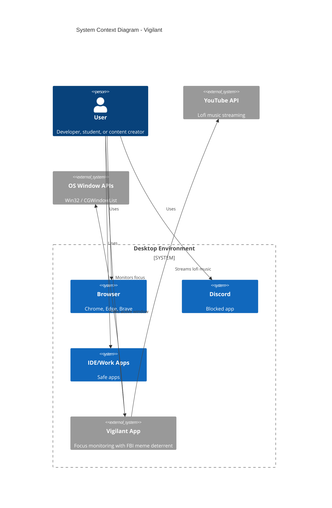
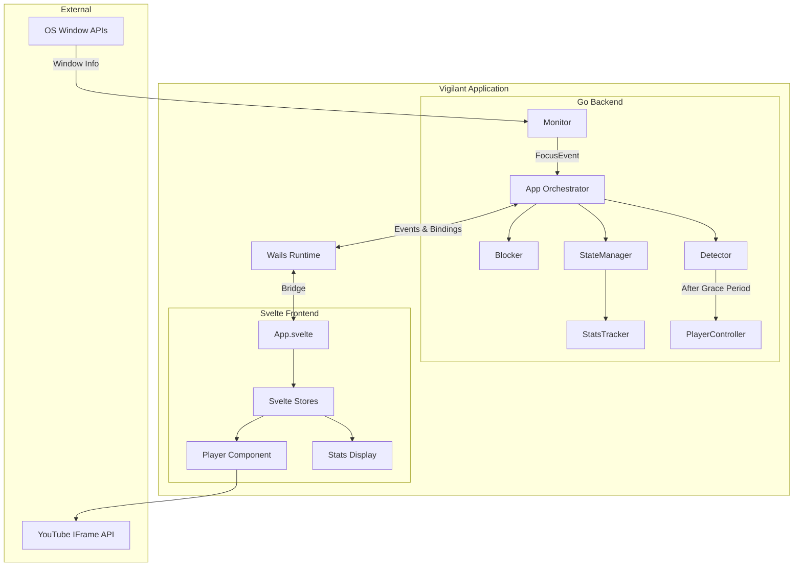
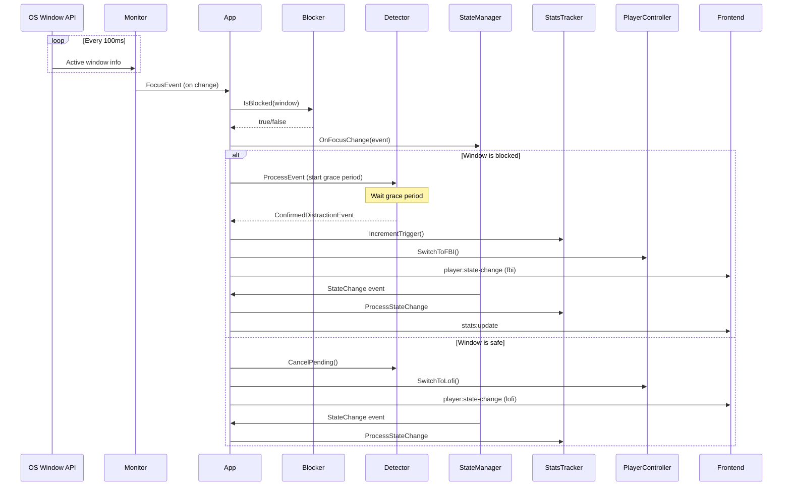
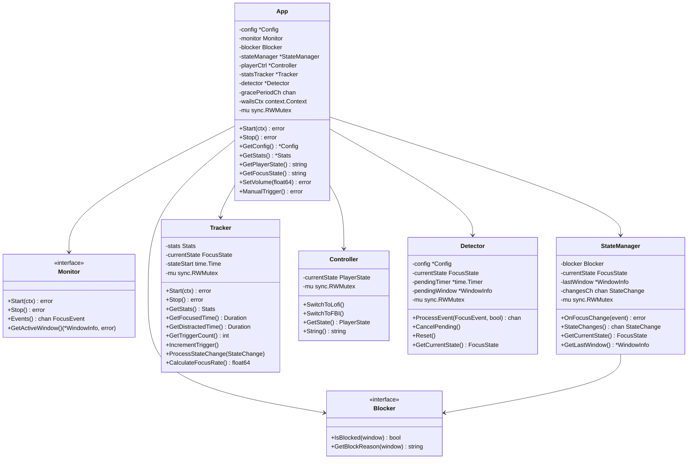
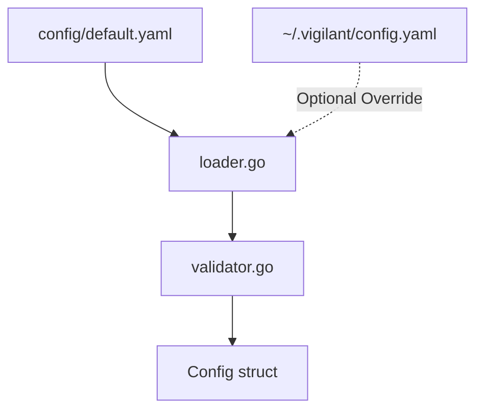
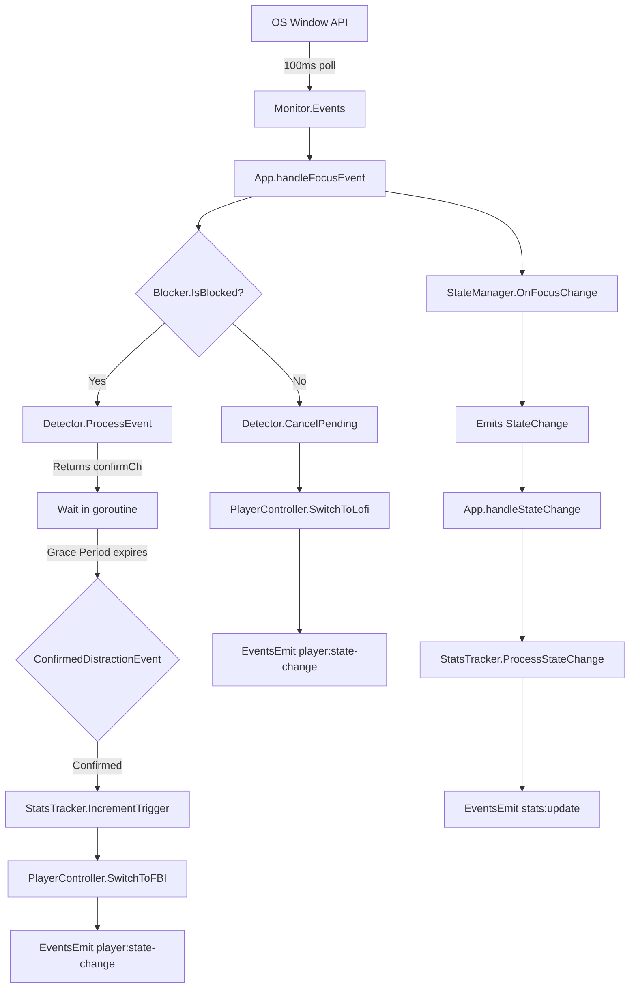
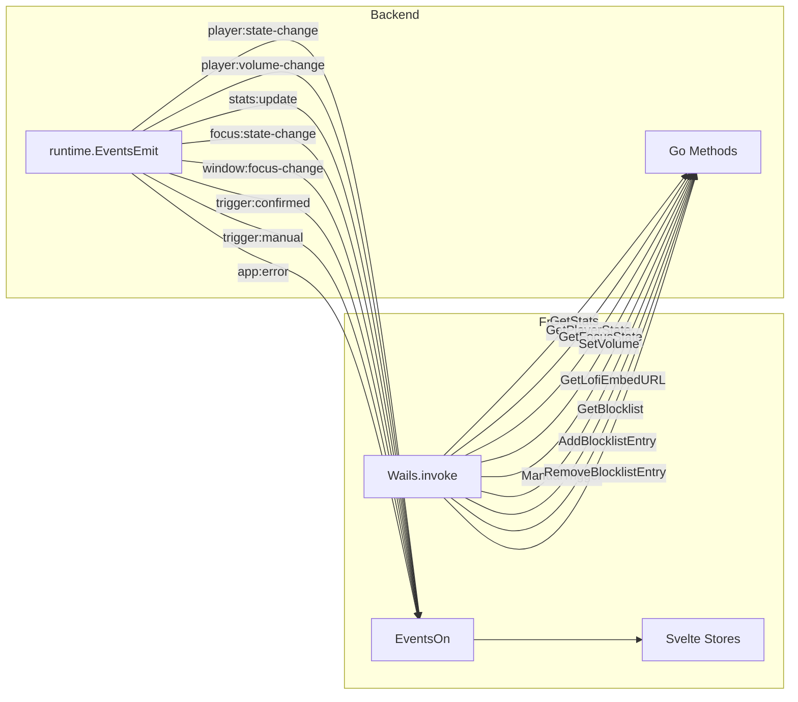
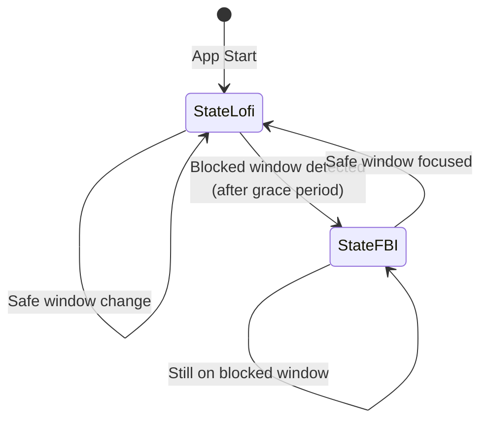
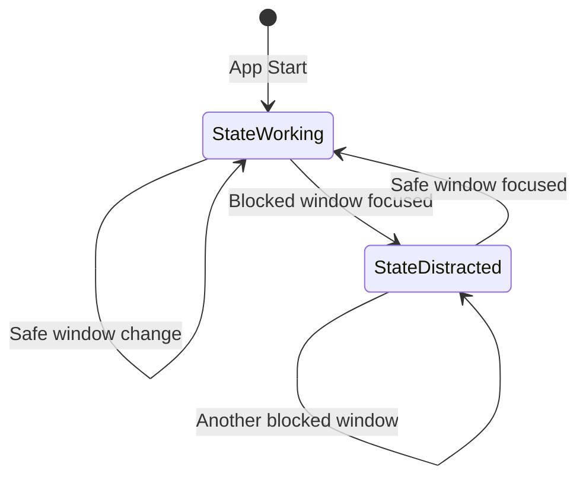

# Vigilant - System Architecture

## Overview

Vigilant is a cross-platform desktop application built with Go and Wails that monitors user focus and provides humorous FBI meme deterrents when accessing blocked applications or websites.

## System Context



## Architecture Overview



## Technology Stack

| Layer | Technology | Purpose |
|-------|------------|---------|
| Backend Language | Go 1.23+ | Cross-platform, fast, single binary |
| Desktop Framework | Wails v2 | Native WebView wrapper (~4MB base) |
| Frontend Framework | Svelte 4 | Lightweight reactive UI |
| Styling | Tailwind CSS v4 | Rapid UI development |
| Icons | Lucide Svelte | Modern icon set |
| Build Tool | Vite | Fast frontend bundling |
| Configuration | YAML + godotenv | Simple configuration |
| Platform APIs | Win32 / CGO+Cocoa | Native window detection |

## Component Architecture

### Event Flow



### Backend Components



#### App Orchestrator (`internal/app/app.go`)
Central coordinator that:
- Initializes all components (monitor, blocker, state manager, player, stats, detector)
- Manages event flow between components via `orchestrationLoop()` goroutine
- Bridges Go backend to Svelte frontend via Wails runtime
- Handles lifecycle (Start/Stop) with context-based cancellation
- Emits events to frontend: player state changes, stats updates, focus state changes, triggers, errors

Public API methods exposed to Wails frontend:
- `GetConfig()` - Returns application configuration
- `GetStats()` - Returns snapshot of current session statistics
- `GetPlayerState()` - Returns current player state ("lofi" or "fbi")
- `GetFocusState()` - Returns current focus state ("working" or "distracted")
- `SetVolume(level)` - Sets player volume (0.0-1.0), emitted to frontend
- `ManualTrigger()` - Manually triggers FBI meme for testing purposes

Key struct fields:
- `config *Config` - Application configuration
- `monitor Monitor` - Platform-specific window monitor interface
- `blocker Blocker` - Blocklist matching interface
- `stateManager *StateManager` - Focus state tracker
- `playerCtrl *Controller` - Media player state manager
- `statsTracker *Tracker` - Session statistics tracker
- `detector *Detector` - Grace period debouncer
- `gracePeriodCh <-chan ConfirmedDistractionEvent` - Confirmation channel
- `wailsCtx context.Context` - Wails runtime context for event emission
- `mu sync.RWMutex` - Thread-safe access to app state

#### Monitor (`internal/monitor/`)
Platform-specific window monitoring implementation:
- `monitor.go` - Interface definition and core types (WindowInfo, FocusEvent)
- `monitor_darwin.go` - macOS implementation using CGO + Cocoa framework (build tag: darwin)
- `monitor_windows.go` - Windows implementation using Win32 API (build tag: windows)
- `detector.go` - Grace period debouncing logic (separate from platform code)

Monitor interface methods:
- `Start(ctx)` - Begins monitoring with configurable poll interval
- `Stop()` - Gracefully stops monitoring and cleans up resources
- `Events()` - Returns read-only channel of FocusEvent objects
- `GetActiveWindow()` - Returns current active window info immediately

Key responsibilities:
- Poll active window at configurable intervals (default 100ms via config)
- Extract window title, process name, PID, and platform handle
- Emit `FocusEvent` only when active window changes (not on every poll)
- Platform-agnostic interface with platform-specific implementations

WindowInfo struct contains:
- `PID uint32` - Process ID
- `Title string` - Window title
- `Process string` - Executable name
- `Handle uintptr` - Platform-specific window handle
- `Timestamp time.Time` - When window became active

#### Blocker (`internal/blocker/`)
Regex-based blocklist matching with state management:
- `blocker.go` - `BlocklistMatcher` implementation with compiled regex patterns
- `state.go` - `StateManager` for focus state (StateWorking/StateDistracted) transitions

Blocker interface methods:
- `IsBlocked(window)` - Returns true if window matches any block pattern
- `GetBlockReason(window)` - Returns debug string indicating which pattern matched

BlocklistMatcher matching strategy:
1. **Exception patterns** (whitelist) - checked first on both title AND process
   - If any exception pattern matches, immediately return false (not blocked)
2. **Block patterns** - checked on both window title AND process name
   - If any block pattern matches either field, return true (blocked)
3. **All patterns** compiled at startup with `(?i)` flag for case-insensitive matching
4. **No simple string matching** - everything is regex-based for flexibility

StateManager responsibilities:
- Tracks current `FocusState` (StateWorking or StateDistracted)
- Evaluates focus changes via `OnFocusChange(event)` using injected blocker
- Emits `StateChange` events only when state actually transitions
- Provides non-blocking buffered channel (`changesCh`) for state change events
- Maintains `lastWindow *WindowInfo` for reference
- Thread-safe with `sync.RWMutex` protection

StateManager methods:
- `OnFocusChange(event)` - Processes focus event and emits state change if needed
- `StateChanges()` - Returns read-only channel for state change events
- `GetCurrentState()` - Returns current FocusState (thread-safe)
- `GetLastWindow()` - Returns last tracked window (thread-safe)

#### Player Controller (`internal/player/player.go`)
Thread-safe media player state management without direct media control:
- Maintains `PlayerState` enum (StateLofi or StateFBI)
- Provides methods to switch between states
- No direct media playback - frontend handles actual playback
- Frontend receives state change events and updates player accordingly

PlayerState constants:
- `StateLofi` - Lofi beats music playing (YouTube embed)
- `StateFBI` - FBI meme video playing (bundled MP4)

Controller methods:
- `SwitchToLofi()` - Changes state to StateLofi (thread-safe)
- `SwitchToFBI()` - Changes state to StateFBI (thread-safe)
- `GetState()` - Returns current PlayerState (thread-safe)
- `String()` - Returns string representation for debugging

Thread safety via `sync.RWMutex` on all state access.

#### Stats Tracker (`internal/stats/stats.go`)
Real-time session statistics tracking with background accumulation:
- Runs background goroutine (`trackingLoop`) with 1-second ticker
- Accumulates time in current state automatically
- Processes state changes to switch which counter accumulates
- Thread-safe access to all metrics via `sync.RWMutex`

Stats struct (returned by GetStats):
- `FocusedTime time.Duration` - Total time in StateWorking
- `DistractedTime time.Duration` - Total time in StateDistracted
- `TriggerCount int` - Number of FBI meme triggers
- `SessionStart time.Time` - When tracking session started
- `LastUpdate time.Time` - Last stats update timestamp

Tracker methods:
- `Start(ctx)` - Launches background goroutine for time accumulation
- `Stop()` - Stops background goroutine gracefully
- `GetStats()` - Returns snapshot of current stats (thread-safe copy)
- `GetFocusedTime()` - Returns just focused time
- `GetDistractedTime()` - Returns just distracted time
- `GetTriggerCount()` - Returns trigger count
- `IncrementTrigger()` - Increments trigger count (called when FBI meme plays)
- `ProcessStateChange(change)` - Handles state transitions, accumulates time in previous state
- `CalculateFocusRate()` - Returns focus rate as float64 (0.0-1.0), formula: FocusedTime / TotalTime

Time accumulation strategy:
- Every second, accumulate elapsed time to appropriate counter based on `currentState`
- On state change, immediately accumulate time since last change to previous state's counter
- Reset `stateStart` after accumulation to track next interval
- Ensures accurate time tracking even with rapid state changes

#### Detector (`internal/monitor/detector.go`)
Grace period debouncing to prevent false positive triggers:
- Applies configurable grace period (default 500ms from config) before confirming distraction
- Cancels pending triggers if user switches away from blocked window before grace period expires
- Returns channel-based confirmation for async processing
- Prevents FBI meme from triggering on brief alt-tab or window switching

Key methods:
- `ProcessEvent(event, isBlocked)` - Starts grace period timer if blocked, returns confirmation channel
  - Returns `<-chan ConfirmedDistractionEvent` that emits after grace period
  - Returns nil if window is not blocked
  - Cancels any previous pending timer before starting new one
- `CancelPending()` - Cancels any pending timer and resets to StateWorking
- `Reset()` - Cancels timer and resets state to StateWorking
- `GetCurrentState()` - Returns current FocusState (thread-safe)

Grace period flow:
1. User focuses blocked window → `ProcessEvent()` called with `isBlocked=true`
2. Detector starts `time.AfterFunc()` timer for grace period duration (500ms)
3. Timer function checks if window is still the same (by PID comparison)
4. If same window → emit `ConfirmedDistractionEvent` on returned channel
5. If user switches away → `CancelPending()` called, timer stopped, channel closed
6. App orchestrator waits on confirmation channel in separate goroutine
7. On confirmation → increment trigger count, switch to FBI meme

Thread safety:
- `mu sync.RWMutex` protects all state access
- Timer cancellation is thread-safe
- PID comparison prevents race conditions with rapid window switches

### Frontend Components

#### App Layout (`frontend/src/App.svelte`)
Main application shell that orchestrates:
- Full-screen video background (toggles between LofiPlayer and FBIVideo)
- Stats glass panel overlay (bottom of screen, above YouTube controls)
- Settings panel (slide-out from right)
- Initializes Wails event listeners on mount
- Subscribes to playerState and focusState stores

#### Components (`frontend/src/lib/components/`)
- **LofiPlayer.svelte** - YouTube iframe embed with:
  - Fallback loading state with lofi background image
  - Error handling for API failures
  - PostMessage control for play/pause based on focus state
  - Layout recalculation workaround for iframe rendering
- **FBIVideo.svelte** - Local video player with:
  - Auto-loop FBI meme video from bundled assets
  - Mute/unmute toggle button (glass style)
  - FBI enter animation
  - Pauses when hidden (parent prop `muted`)
- **StatsDisplay.svelte** - 4-column glassmorphism panel displaying:
  - Focused time, distracted time, FBI triggers, focus rate
  - Settings button (top-right)
  - Session start time footer
  - Duration formatting helper
- **SettingsPanel.svelte** - Slide-in panel from right with:
  - Header with close button
  - Backdrop blur overlay
  - Contains BlocklistEditor component
- **BlocklistEditor.svelte** - Blocklist management UI:
  - Add/remove patterns (apps/websites to block)
  - Add/remove exceptions (whitelist)
  - Calls Wails bindings: GetBlocklist, AddBlocklistEntry, RemoveBlocklistEntry
  - Keyboard support (Enter to add)

#### State Management (`frontend/src/stores/app.ts`)
Svelte stores for real-time state:
- **stats** - Session statistics (focusedTime, distractedTime, triggerCount, sessionStart, lastUpdate)
- **playerState** - Current player mode ('lofi' | 'fbi')
- **focusState** - Current focus state ('working' | 'distracted')
- **initializeEventListeners()** - Sets up Wails event subscriptions (called once on mount)

Event listeners for backend events:
- `player:state-change` - Updates playerState
- `focus:state-change` - Updates focusState
- `stats:update` - Parses Go duration strings (e.g., "1h2m3.456s") and updates stats
- `window:focus-change` - Logs window changes for debugging
- `trigger:confirmed` - Logs FBI trigger confirmations
- `app:error` - Logs backend errors

#### TypeScript Types (`frontend/src/types/index.ts`)
- **Stats** - Session statistics interface
- **PlayerState** - Player mode type ('lofi' | 'fbi')
- **FocusState** - Focus state interface

#### Wails Integration (`frontend/wailsjs/`)
Auto-generated TypeScript bindings:
- `go/main/VanillaApp` - Typed Go method bindings (GetStats, GetLofiEmbedURL, GetBlocklist, etc.)
- `runtime/runtime` - Event system (EventsOn, EventsEmit)

## Data Flow

### Configuration Loading



### Focus Detection Flow



### Wails Event System



## State Machine

### Player States



### Focus States



## Key Design Decisions

### Interface-Based Architecture
All major components expose interfaces for testability and platform abstraction:
```go
type Monitor interface {
    Start(ctx context.Context) error
    Stop() error
    Events() <-chan FocusEvent
}
```

### Build Tags for Platform Code
Platform-specific implementations use Go build tags:
- `//go:build darwin` - macOS only
- `//go:build windows` - Windows only

### Thread Safety
- `sync.RWMutex` for shared state
- Channel-based communication between goroutines
- Context for lifecycle management

### Configuration Over Code
Behavior configured via YAML:
- Blocklist rules (processes, websites, patterns)
- Exceptions (whitelist)
- Monitor intervals
- Player settings

## Security Considerations

- **No telemetry**: No data collection or phone-home
- **No elevated privileges**: Standard user permissions only
- **Local configuration**: No network-based config
- **Minimal permissions**: Only window title reading required

## Performance Characteristics

| Metric | Target | Notes |
|--------|--------|-------|
| Startup time | < 2s | From launch to UI displayed |
| Memory usage | < 100MB | During normal operation |
| CPU usage (idle) | < 2% | When monitoring |
| CPU usage (active) | < 5% | During state changes |
| Binary size | 10-15MB | Includes bundled FBI video |

## External Dependencies

### Runtime Dependencies
- **YouTube IFrame API**: For lofi music playback
- **OS Window APIs**: For focus detection

### Build Dependencies
- **Wails CLI**: Desktop app bundling
- **Go 1.23+**: Backend compilation
- **Node.js 18+**: Frontend build
- **npm**: Package management

## Future Architecture Considerations

### Phase 2
- Hot-reload configuration
- System tray integration
- Work profiles

### Phase 3
- SQLite for historical stats
- Pomodoro timer integration
- Terminal TUI mode

---

**Last Updated**: 2025-12-11
